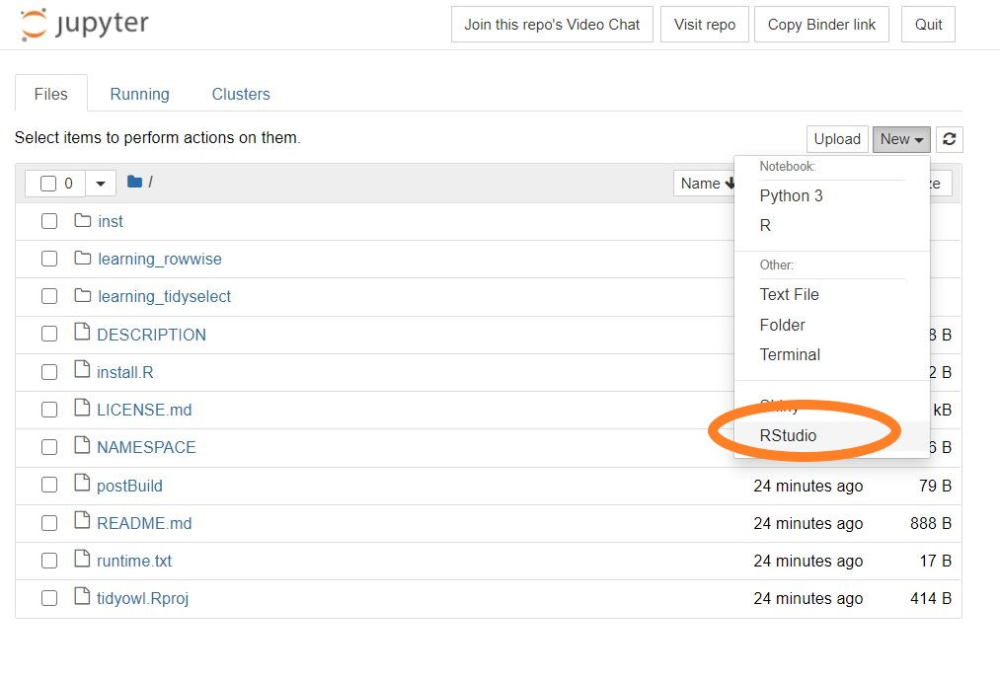

The `learnr` package is a wonderful way to package your tutorials. Anyone can download a `learnr` package of tutorials, and use `learnr::run_tutorial()` to run them on their own personal system. 

Since `learnr` is based on `shiny`, these tutorials can also be published to a `Shiny` server such as `shinyapps.io`. However, one drawback to this is that the more popular the tutorial, the more access time you may be on the hook for, which can rapidly become expensive.

Enter mybinder.org, which is a way of running reproducible analyses and tutorials. In short, you give a mybinder.org server some information about the software environment needed to run your code, and you can run code based on your repo. Mybinder.org servers are a little limited, (1 Gb RAM), but this is more than capable of running most `learnr` tutorials.

Recently, they added Shiny as a deployable format, which means you can run shiny apps, including `learnr` tutorial packages off their servers.

I'm starting a `learnr` tutorial package called [`tidyowl`](https://github.com/laderas/tidyowl) and I decided to share what I've learned.

## What's the problem?

However, there are some differences between the file structure of a `learnr` package and the expected file structure of a shiny-ready mybinder.org repository. 

Can we get both setups to work at the same time? Yes, we can.

## Why would we want to run learnr tutorials off mybinder.org?

The short answer is making your material accessible to as many people as possible. `learnr` tutorials can be run from a phone or tablet, and running your tutorial for a lot of people doesn't cost you any bandwidth or usage costs, as you're using the same infrastructure that mybinder.org provides.

## Quick Review of `learnr` package structure

For a package, `learnr` tutorials are stored in the following folder:

`inst/tutorials/TUTORIAL_NAME`

So, if you had a tutorial named `learning_shiny` it would live in

`inst/tutorials/learning_shiny/` 

and the `.Rmd` file containing the tutorial should be named `learning_shiny.Rmd` as well.

The problem I encountered is that mybinder.org expects your tutorial to exist as a folder in the root of the repo. In other words, it needs to see

`learning_shiny/` in the root of the repository to run. 

We can fix this by adding a file called `postBuild` that gives instructions to run after the software environment is built. We'll use it to copy the tutorials into the root folder.

## Making your tutorial mybinder.org ready

In short, you'll need 3 files to make your `learnr` tutorial mybinder.org ready: a `runtime.txt`, a `install.R `, and a `postBuild` file in order to make your `learnr` package compatible with mybinder.org. Let's go through the steps:

Step 1. Specify a `runtime.txt` file in your root folder. You'll need a file called `runtime.txt` that contains a single line:

```
r-3.6-2020-08-01
```

This gives mybinder.org the signal that the Docker image needs to have R installed. You can see that I specified a version (3.6) and a snapshot date (2020-08-01). These should be a valid version and date for the snapshot - check the MRAN pages for more info: https://mran.microsoft.com/

*Note: When R 4.0 and greater is available in MRAN, you should move to it. It includes RStudio Package Manager, which installs the binary images rather than installing from source code which speeds up building the Docker images by quite a bit.*

*Another Note: I tried to get this to work with a `Dockerfile` using the `rocker/binder` images, but I couldn't get this image to work. If anyone has gotten this working, I'd appreciate you sharing how you did it.*

Step 2. Specify package dependencies using `install.R` in your root folder - in this file, you'll need to specify all the packages your tutorial is dependent on using `install.packages()` commands. Here's the contents of my `install.R` file:

```
install.packages("learnr")
install.packages("here")
install.packages("tidyverse")
```

Note: getting the dependencies right in package building can be major headaches to getting your binder container to work. You may have to specify some [system dependencies](https://mybinder.readthedocs.io/en/latest/config_files.html) in your `apt.txt` file for certain packages. This information is available here: https://github.com/rstudio/r-system-requirements

Step 3. Specify moving the tutorials in `inst/tutorials/` to the repository root folder using the `postBuild` folder. These commands are run after the container is built and will make the tutorials accessible via Binder.

For example, for the `tidyowl` package, I have these `mv` commands in my `postBuild`:

```
mv inst/tutorials/learning_tidyselect/ .
mv inst/tutorials/learning_rowwise/ .
```

You'll need a `mv` line for each tutorial that your package contains.

### Note: Using `holepunch`

I believe you can also use `holepunch` to make setup a little easier. https://github.com/karthik/holepunch 

I haven't tried it yet, but will update this when I do.

## Build the Docker Image for your tutorial

Okay, almost there! Now we're going to go to `mybinder.org` to build your Docker image. This is the software environment that your tutorial will run off of. This image will have shiny-server and RStudio installed on it automatically, which makes debugging your package easier.

When you're ready, go to https://mybinder.org and put in the public location of your repository. Then click the "Launch" button.

Now your container will build. Note that this will take a little while (10+ minutes), especially if you need to install something like `tidyverse`. Note that this can be one of the hardest steps to get going, especially if you need packages such as `sf` (see above for a link to system dependencies).


When it's done building, you'll be at a Jupyter page. Click "New >> RStudio" to open up your image with RStudio.



You should see that your tutorial folders have been moved to the root folders. This is good confirmation that the `mv` statements of `postBuild` work. I personally like to have individual `data/` folders in each tutorial, as it makes making them a little easier to deploy.

Test out running the tutorial by going to the .Rmd file and running it.


If you've setup everything right, you should see your `learnr` tutorial popup. I will say that this is usually the fine tuning step that takes the longest. 

*Note: there is a GitHub action (https://github.com/jupyterhub/repo2docker-action) to rebuild your Docker image on new commits. I'll be looking into this in the future.*

## Specify the URL for running your tutorial.

Each tutorial in your package will need its own URL to run.

You'll add the following to your mybinder.org link:

```
?urlpath=shiny/learning_tidyselect/
```

The `urlpath` is a signal to mybinder that it will need to run shiny, and you'll put the name of your tutorial folder instead of `learning_tidyselect`. Note the trailing slash after `learning_tidyselect`.

So, my final URL for the `learning_tidyselect` tutorial is this (click it and try it out):

https://mybinder.org/v2/gh/laderast/tidyowl/master?urlpath=shiny/learning_tidyselect/

You can now send this link out and nearly anyone in the world can run your `learnr` tutorial without installing R and not using up precious Shinyapps.io CPU time!

## Caveats

Shiny apps may suddenly disconnect - have students reload the page if that happens.

Images get deleted off the mybinder.org servers within a week, so it is worth automating your container build to do so every week so that your students don't have to wait for your container image to rebuild.

Also, progress is not saved, because the final url is different each time you run it off mybinder.org servers. 

## Acknowledgements

Thanks so much to the `mybinder.org` team, what they do is beyond awesome.

Thanks to Sang Yun Oh, whose repository helped me figure more of these details out. https://github.com/syoh/learnr-tutorial
