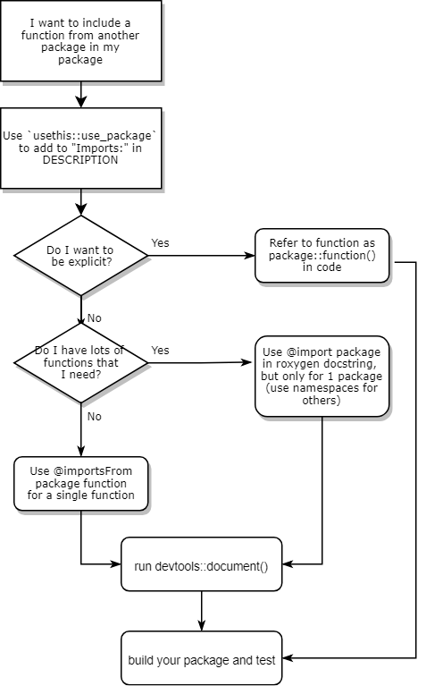

As part of my new year's resolution to learn new things about R, I'm trying to plug some holes in my R knowledge by writing more vignettes to explain them to myself this year.

This week I finally think I understand more about namespaces in R and why you should use them in your R package.

## Namespaces: Why Bother?

In short, we need namespaces because of the *ambiguity* of function names. Think of how many packages have a `filter()` function! How does R know which function from which package you’re talking about? One nightmare case is the Bioconductor `exprs()` method and the `rlang` `exprs()` function. These functions do very, very different things (one of them extracts an expression matrix from a Bioconductor `ExpressionSet`, and the other one is used for quoting multiple expressions).

What happens when you call `library` on both of these packages? The worst case scenario is that you mean to call one package function and R executes the other one. This is called a namespace collision, and unfortunately it can break your code.

Enter the namespace, which allows us to be package and function specific. If I want to use the function `filter` from `dplyr`, I write it as `dplyr::filter`. The `dplyr::` part is the namespace of the `dplyr` package.

## `DESCRIPTION`: The gatekeeper for calling packages

The `DESCRIPTION` file is one of the gatekeepers in your package. Ever wonder how `install.packages` knows how to install the packages your package depends on? It’s actually because of a field in the `DESCRIPTION` file. Here's the `DESCRIPTION` file for my `burro` package:

```
Package: burro
Type: Package
Title: Shiny App Package for setting up a data exploration session ("burro"w into the data)
Version: 0.1.0
Authors@R: as.person(c(
    "Ted Laderas <tedladeras@gmail.com> [aut, cre]",
    "Jessica Minnier <minnier@ohsu.edu> [ctb]",
    "Gabrielle Choonoo <choonoo@ohsu.edu> [ctb]"
  ))
Maintainer: Ted Laderas <ted.laderas@gmail.com>
Description: Allows the teacher to deploy a simple data exploration app for exploring a dataset (mostly for teaching purposes).
License: MIT LICENSE
Encoding: UTF-8
LazyData: true
Imports:
    dplyr,
    shinydashboard,
    ggplot2,
    visdat,
    skimr,
    naniar,
    data.table,
    magrittr,
    glue,
    usethis,
    here,
    viridis,
    DT
Depends:
    shiny
Roxygen: list(markdown = TRUE)
RoxygenNote: 6.1.0
Suggests:
    testthat
```


Look at the `Imports:` field. You can see a list of all of the packages that `burro` utilizes. In ye olde days of R, we used the `Depends:` field. Nowadays we use the `Imports:` fields. [Here's a Stack Overflow post explaining why](https://stackoverflow.com/questions/8637993/better-explanation-of-when-to-use-imports-depends). The main reason is that `Imports:` requires the package to have a namespace.

Modifying the `DESCRIPTION` file by hand is possible, but I don’t recommend it. Instead, you can use the `usethis` package to modify it. For example, if I want to use `dplyr` in my package I can do this in the console, while I am building it.

```
usethis::use_package("dplyr")
```

This will add `dplyr` to the `Imports:` field of your `DESCRIPTION` file. 

**Addition (Thanks Hao Ye, for the suggestion)**: If the function is in a development version (i.e., hosted on GitHub), you can use `usethis::use_dev_package()` to add it to your `DESCRIPTION` file. It will add an additional field called `Remotes:` to your package:


```{r eval=FALSE}
usethis::use_dev_package("tidyverse/dplyr")
```

For more info about using remotes, check out the vignette: https://remotes.r-lib.org/articles/dependencies.html

## Using namespaces to call functions from other packages

Now that we have specified the package in our DESCRIPTION file, we can now call any function in `dplyr` by adding a `dplyr::` before the function. So if we wanted to call `mutate()` in our package function we can do this:

```
mutate_iris <- function(iris){
    dplyr::mutate(iris, sepal_sum = Sepal.Length + Sepal.Width)
}
```

In many cases, calling a function by specifying its namespace is good practice. For one, there are many functions called `filter()`: I can think of at least the ones that are in `base` and `dplyr`. Using the namespace makes it *unambiguous* to both R and other developers which `filter()` function you're talking about.

## How do I call functions from other packages? Using `roxygen` docstrings

Ugh, I've already written a bunch of code and I don't want to add the namespaces before all of the functions from other packages! How can I avoid this?

This is where `roxygen` and `devtools::document()` come in.

`roxygen` docstrings are responsible for at least three things in your package: 1) producing the documentation (`.Rd`) files, but also: 2) specifying what package namespaces you want to utilize, or import in your function, and 3) whether you want to export that function (i.e., make it accessible publicly).

How do they accomplish 2)? When you call `devtools::document()` to build the documentation, they scan for multiple fields, such as `@import` and `@importFrom` in the `roxygen` doc strings. Then `devtools::document()` actually modifies the `NAMESPACE` file in your package.

## Using `@importFrom`: When you only need one function

Say you just wanted to use `filter` from `dplyr`, but didn't want to write `dplyr::filter` before all of your functions. You can just import the `filter()` function by including the following docstring:

```
#' @importFrom dplyr filter
```

And then you can just use `filter()` like normal in your code:

```
#' @importFrom dplyr filter               #This is where you add the @importFrom
use_filter <- function(df, cutoff=0.5) {

  filter(df, value < cutoff)

}
```

## Using `@import`: When you need a lot of functions from a package

What if you had a lot of functions from one package, such as `shiny`, that you want to use? Do you need to add an `@importFrom` for each of these functions? Nope. You can just use one `@import` field for the whole package:

```
#` @import shiny
```

And then code like usual:

```
#` @import shiny            # This is where you add the @import
shinyUI <- function() {
    selectInput("")
}
```

## Importing multiple packages: just don't do it (UPDATED).

Just a note to not import multiple packages using `@import`. As Hadley Wickham has noted, you have no control over the development of the packages you import. Just because there are no function collisions right now between the packages doesn't mean that one of the developers may add a function down the line that might collide. So, if you need to use multiple packages, `@import` one package and use `@importsFrom` or namespaces to refer to functions in the other packages.


##  Exported versus Internal functions

Remember I mentioned ‘@export’ above? Specifying in a docstring for your function *exports* it. Specifying it means that ‘devtools::document()’ will add an `Export` directive for the function in the NAMESPACE file. That means you can access it using ‘::’. Going back to our `use_filter` example:

```
#' @export                              #This is where you add the @export
#' @importFrom dplyr filter
use_filter <- function(df, cutoff=0.5) {

  filter(df, value < cutoff)

}
```

If our package name is `mypackage`, then this function will be accessible if we use `library(mypackage)` or `mypackage::use_filter()`.

Why is this important? You may write some *internal* functions that are useful in your package, but they aren’t necessarily ones you want your users to use in their daily use. `@export` allows you to control which functions you make publicly accessible in your package.

For example, try typing `dplyr::` in RStudio and hit the tab key. You’ll see the usual `dplyr` verbs pop up. But these are only the exported functions. Now try `dplyr:::` and hit the tab key. You’ll see a list of functions that pop up that’s much longer - these are all the functions, including the internal functions.

So, if there’s a cool bit of internal code you want to use in a package, you can use ‘:::’ to specify it. Just be aware that oftentimes, internal functions may change a lot as code gets refactored, so code that utilizes them may be refactored.

## Remember to run `devtools::document()`

Once you've written code and want to test it in your package, remember to run `devtools::document()` before you reinstall your package for testing. Otherwise, the `NAMESPACE` file won't be modified, and your code won't work.

You can also modify your Project Options for your package and check the **Tools >> Project Options >> Build Tools >> Generate Documentation with Roxygen** box. Next to it, there is also a `Configure` button that lets you select the option to run `devtools::document()` whenever you build a package for testing. 

## Go forth and Package!



TL;DR:

1. Use `usethis::use_package()` to add packages to your `DESCRIPTION` file (while in the console) after you've created your package skeleton using `use_package()`.
2. Use namespaces (such as `mypackage::usefilter()`) to refer to external functions where possible to avoid collisions in function names when you are writing code.  
3. Use `@imports` and `@importsFrom` judiciously in your `roxygen` documentation for a function if you need to use many extenral package functions within a function.  Use only 1 `@import` statement in a function, use namespaces/`@importsFrom` for the other packages.
4. Expose functions you want to be made public using `@export` in your `roxygen` documentation.
5. Remember to run `devtools::document()` in the console after you modify/add these fields to the roxygen documentation when you build for testing, or set it up in **Tools >> Project Options**.

I hope this helps you to understand exactly the relationships between all of the components that are responsible for accessing namespaces in your package. I was confused about this for years, so writing this has helped me understand these relationships.

## Further Reading

- If you want to know how R searches for a function across its environments and why namespaces are a good thing, this is an excellent writeup: http://blog.obeautifulcode.com/R/How-R-Searches-And-Finds-Stuff/
- More about the `usethis` workflow: https://www.hvitfeldt.me/blog/usethis-workflow-for-package-development/ 
- More about the `DESCRIPTION` file: http://r-pkgs.had.co.nz/description.html
- More about namespaces: http://r-pkgs.had.co.nz/namespace.html
- More about roxygen: http://r-pkgs.had.co.nz/man.html#roxygen-comments
- An alternative workflow to modify the `DESCRIPTION` file: You can use `attachment::att_to_description()` to scan code and add packages to the file after coding (thanks,  Sébastien!).

## Acknowledgements

Thanks to Hao Ye, Sébastien Rochette, Michael Chirico, Tim Hesterberg, and Hadley Wickham for their comments and questions. I've incorporated your suggestions.

## Note

I want this to be clear and correct. Please [email me](mailto:laderast@ohsu.edu) if there are any mistakes I've made.
