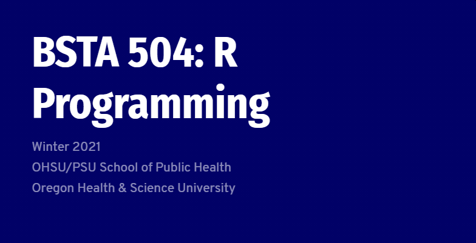

```{r setup, include=FALSE}
knitr::opts_chunk$set(echo = FALSE)
```

```{r}

```

# Learning Objectives

- **Understand** and **utilize** R/RStudio.
- **Understand** basic data types and data structures in R.
- **Familiarize** and **load** data files (Excel, Comma Separated Value files) into R/Rstudio, with tips on formatting.
- **Visualize** datasets using ggplot2 and **understand** how to build basic plots using `{ggplot2}` grammar.
- **Filter** and **format** data in R for use with various routines using `{dplyr}`.
- **Execute** and **Interpret** some basic statistics in R using `{broom}`.
- **Automate** repetitive tasks in R, such as loading a folder of files using `{purrr}`.
- **Execute** basic machine learning workflows using `{tidymodels}`.

# Course Links

[Course Website](https://sph-r-programming.netlify.app){.btn .btn--info}
[Course Syllabus](https://sph-r-programming.netlify.app/syllabus/){.btn .btn--info}

